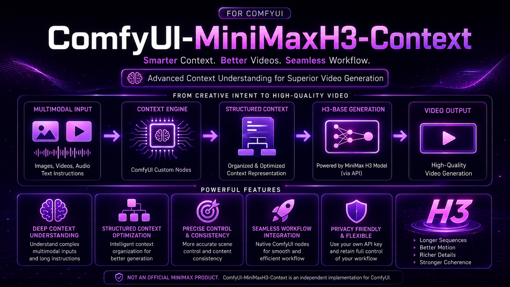

# ComfyUI-MiniMaxH3-Context

## Turn Ideas and References into Generation-Ready Video Context

**Coming soon — open source.**

ComfyUI-MiniMaxH3-Context is a creator-focused toolkit that turns written ideas, images, and reference media into clear, structured direction for MiniMax H3 video workflows.

Describe the video you want, add any visual references, and let the workflow organize the subjects, actions, camera direction, timing, dialogue, visual style, and audio intent. The result is a polished prompt, an easy-to-review context summary, and a visible ComfyUI workflow ready to connect with compatible downstream generation nodes.

No complicated prompt engineering. No hidden processing. No repetitive copying and pasting.

## One Guided Experience for Every Creative Mode

The first release is designed to support:

- **Text to Video** — Build a complete video direction from a written idea.
- **Image to Video** — Use an opening image as the visual starting point.
- **First and Last Frame to Video** — Guide the transformation between two key images.
- **Last Frame to Video** — Shape a sequence toward a defined final image.
- **Reference to Video** — Use ordered image and video references to guide characters, environments, motion, style, and continuity.

## Made for Creative Control

- Turn simple ideas into detailed, generation-ready video direction.
- Keep dialogue, lyrics, captions, signs, and important instructions intact.
- Organize characters, scenes, actions, camera movement, style, sound, and timing.
- Give every image and video reference a clear purpose.
- Review how your request was understood before generation begins.
- Connect the final prompt directly to compatible ComfyUI generation workflows.
- Use a guided sidebar, reusable workflows, or individual ComfyUI nodes.
- Keep the workflow visible, editable, and under your control.

## From Idea to Generation

1. Choose a creative mode.
2. Describe your idea.
3. Add the images or references you want to use.
4. Review the interpreted creative direction.
5. Start the connected ComfyUI workflow.
6. Continue directly into video generation.

Copying and pasting remains available when you want it, but it is not required. The guided experience is designed to prepare and connect a visible ComfyUI workflow for you.

## Local-First and Privacy-Conscious

Your creative material stays under your control. The project does not silently select an online service, upload media, or hide network activity behind a convenient button.

Model weights and video generation remain handled by the compatible model and generation nodes you choose.

## Independent and Open Source

ComfyUI-MiniMaxH3-Context is an independent project created for the ComfyUI community. It is not an official MiniMax implementation and does not claim to reproduce private MiniMax systems.

Its goal is simple:

> Make complex H3 context preparation easier to use, easier to understand, and easier to connect to real ComfyUI generation workflows.

## Coming Soon

**ComfyUI-MiniMaxH3-Context will be released as an open-source project in the near future.**

Follow this repository for the first public release, example workflows, installation instructions, and the complete guided Sidebar App Mode experience.

[Explore the full product preview →](docs/PRODUCT_PREVIEW.md)
